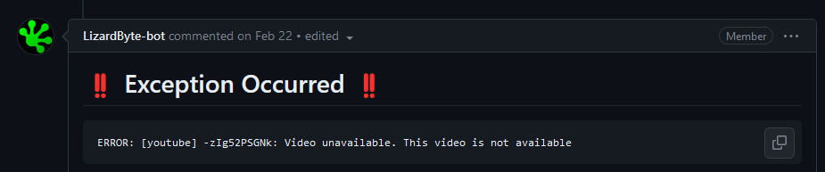
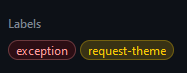
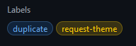

# Approver Guide

The following guide is meant for authorized Themerr approvers to use when approving theme submissions.

## Process

1.  Open the issue on GitHub
2.  Inspect the issue title

  - It should have the theme type in brackets.
    - Valid types are "MOVIE", "MOVIE COLLECTION", "TV SHOW", "GAME", "GAME COLLECTION", "GAME FRANCHISE"
  - The title of the item should follow it. If it is a Movie, TV Show, or Game, it will have the year in parenthesis.
    Collections and Franchises will not have the year.

- [ ]  Check if the issue has an exception
- An exception is indicated a couple ways:

First is an exception comment

  

Second is a label that is added to the issue

  

- If there are exceptions, we cannot add the theme.
  Usually it's due to a regional block or age restriction on the video they submitted.
  We need to direct the user to correct it by editing their original submission.

- [ ]  Check if the issue is a duplicate submission
- An duplicate submission is indicated by a label:

  

- Duplicate submissions modify themes currently in the database and need to be investigated with more scrutiny as we
  don't want to accidentally overwrite a good theme with a lower quality theme.
- If an issue is marked as a duplicate, check the reason for the theme change in the user's submission, then determine
  if the theme is better than the present one and meets our criteria for theme submissions.
> [!NOTE]
> If there is no reason given, the issue can be closed.

- [ ] Understand the contents of the comment from LizardByte-Bot
Specifically check the git diff.

- [okay.diff](../docs/references/okay.diff) is an example of one that is okay to add.
  Basically, if there are new files added, this is a good sign! Lots of green is good!

- [do_not_add.diff](../docs/references/do_not_add.diff) is an example of one that is not okay to add.
  The youtube_theme_url did not change... so basically they have submitted an edit to an item already in the library,
  but they left the theme the same as the one we already have.
  In this case, the bot will automatically flag this and close the issue.

- [ ] Watch/listen to the theme on youtube

- This portion comes down to human judgement, but the [Theme Guidelines](../docs/Theme_Guidelines.md) should be
  referenced for precise rules when deciding.
- Typically when examining a theme, we set the computer to about 50% volume then right-click and open the theme in an
  incognito window (so google doesn't recommend stuff based on every theme that's reviewed).

- [ ] Approve the theme
- First, make sure the latest bot comment matches the latest edit of the issue body (it might take a few minutes,
  depending on how busy the GitHub activity is in our org at the time).
- To approve the theme, comment `@LizardByte-bot approve`. This will initiate a bot workflow where it will add the
  `approve-queue` label. Once the issue comes to the front of the queue, the bot will run the checks again, then it
  will add the theme to the database (assuming it passes everything).
> [!WARNING]
> Try to avoid approving any themes when a scheduled update is running.
  You can check for that [here](https://github.com/LizardByte/ThemerrDB/actions/workflows/update-pages.yml?query=event%3Aschedule).
  It runs at 12:00 UTC daily.

## Helpful Tools

- If you have a question or suggestion for a theme submission, place your comment, then add the `question` label to mark the issue.
> [!NOTE]
> If a user fails to answer your question after about a week or longer, you can proceed how you think best with the theme.

- A youtube URL in a user submission can be edited by commenting `@LizardByte-bot edit {youtube_url}`.
  This will replace the youtube URL and run the workflow to check the new URL.

- A bot workflow to check a theme can be manually initiated by first removing, then adding the `request-theme` label.

- A bot workflow to begin adding a theme can be manually initiated by adding the `approve-queue` label.
> [!NOTE]
> These labels should typically not need to be manually added, but they are helpful for troubleshooting.
