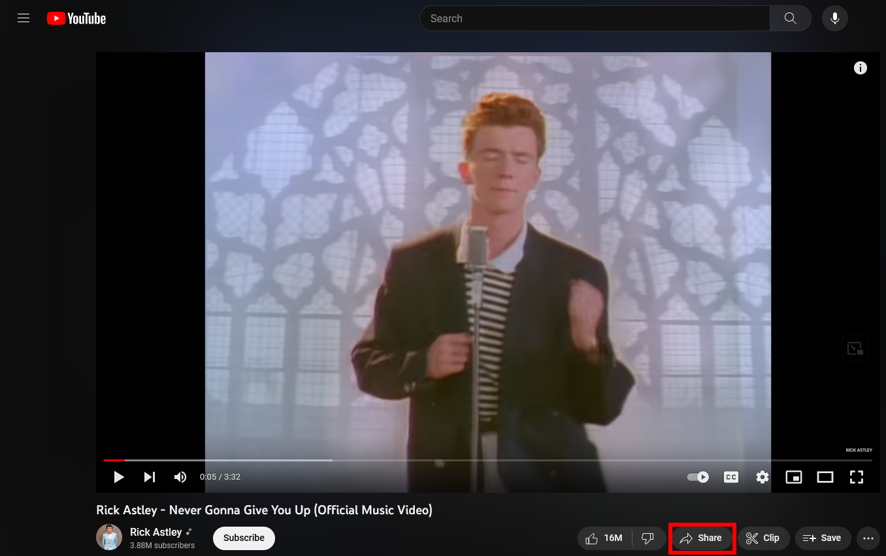
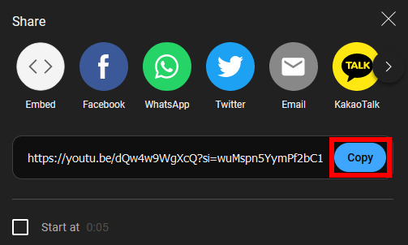

# YouTube URLs

YouTube URLs should only contain the video ID parameter. i.e. `https://www.youtube.com/watch?v={VIDEO_ID}` or
`https://youtu.be/{VIDEO_ID}`

> **Warning**
> If the URL contains the playlist parameter, we will select the first video in the playlist, which may not be your
> intended video.

## How to share a minimal URL.

1. Navigate to the video you want to share.
2. Click the share button.

   

3. Click the copy button.

    
